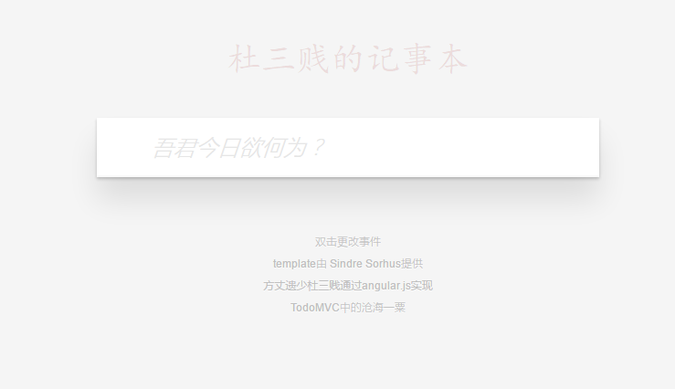

# 每一个框架使用者必学的入门经典——todoMVC
### 方丈遗少杜三贱，丁酉四月十六(2017.5.11)

> Template 提供： [TodoMVC](http://todomvc.com) apps
  Demo制作: [方丈遗少杜三贱](https://fzysdsj.github.io/)
  框架: [angular 1.4.9版](https://angularjs.org/)




## 如何使用
>- git clone "https://github.com/fzysdsj/todoMVC-angular.js-demo.git"
## 在线测试
>- "https://fzysdsj.github.io/todoMVC-angular.js-demo/#/"
## 使用心得
>- angular双向数据绑定不要太爽。
>- 我收回以前说的那些话，angular会有未来的，并且是很广大的未来，就像我钟爱的node一样。

## 相关难点
- 数据存储(services/main.js)
```javascript 
	this.save = function(){
	storage['my_todo_list'] = JSON.stringify(todosFzys);
}
```
- 路由选择
```html 
<!DOCTYPE html>
<html lang="en">
<head>
	<meta charset="UTF-8">
	<title>马蛋，不想写了=,=</title>
</head>
<body>	
</html>
```

## 写在后面
> 写在后面的当然是广告时间了，贫僧将会在博客上连载自己的自传，有意者请关注[方丈阁](https://fzys.github.io/)(虽然并没有关注功能),贫僧QQ：505589500,也欢迎各位大神赐教。


